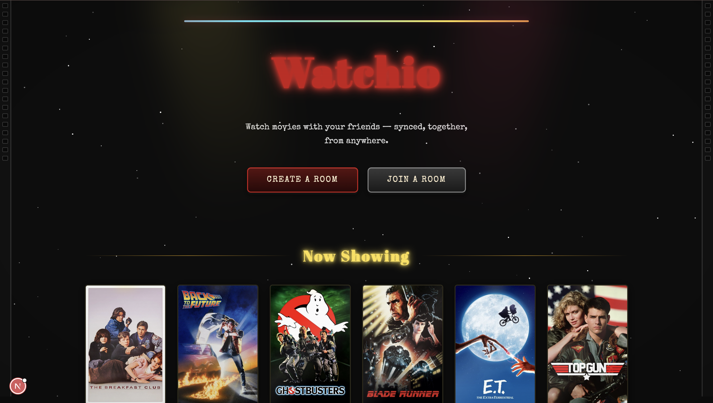
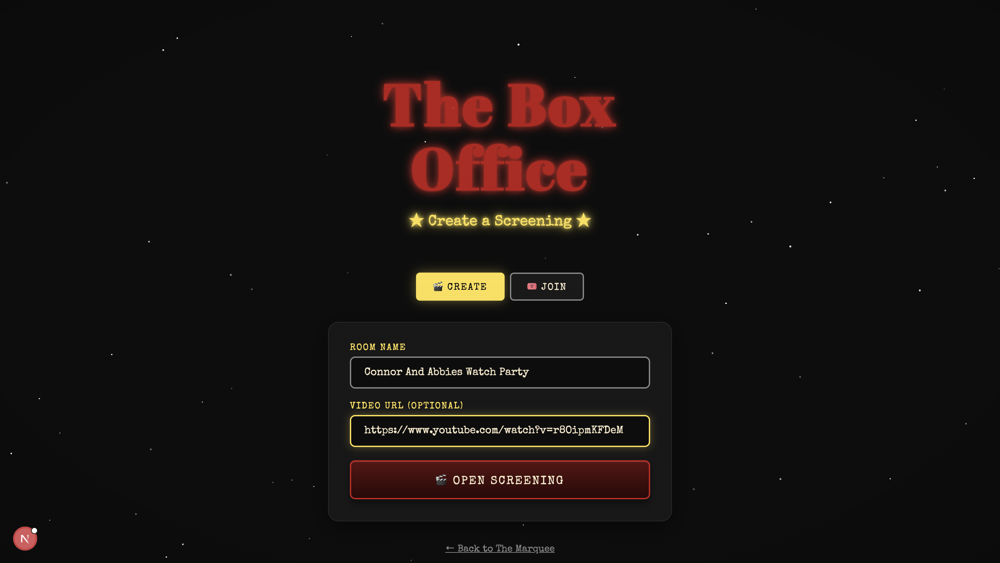
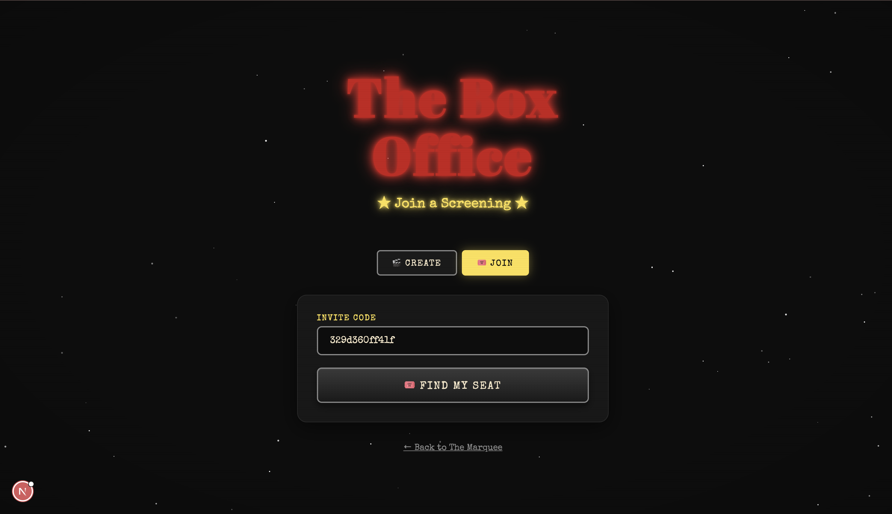
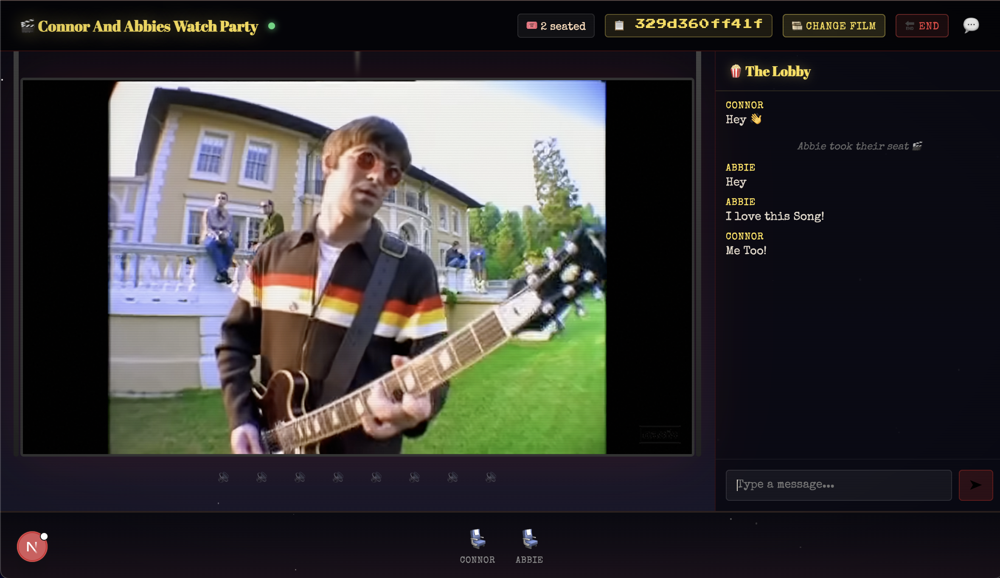

# Watchio

Watchio is a synchronized watch party platform that lets you watch videos with friends in real time. Paste any YouTube link, share a room code, and everyone stays perfectly in sync -- play, pause, seek, and chat together.

## Project Structure

```
watchio/
  web/          Next.js frontend (React 19, Framer Motion)
  server/       Express + Socket.io real-time server
  extension/    Chrome extension for overlay controls
  supabase/     Database schema (PostgreSQL with RLS)
  images/       Screenshots for documentation
```

## Tech Stack

- **Frontend:** Next.js 16, React 19, Framer Motion, custom CSS
- **Server:** Node.js, Express, Socket.io
- **Database:** Supabase 
- **Real-time sync:** Socket.io WebSockets
- **Video:** YouTube IFrame Player API

## Prerequisites

- Node.js 18+
- npm 9+
- A Supabase project (free tier works)

## Setup

### 1. Clone the repository

```bash
git clone https://github.com/your-username/watchio.git
cd watchio
```

### 2. Install dependencies

From the project root (uses npm workspaces):

```bash
npm install
```

### 3. Configure environment variables

Create a `.env` file in the `server/` directory:

```
PORT=3001
SUPABASE_URL=https://your-project.supabase.co
SUPABASE_SERVICE_KEY=your-service-role-key
```

Create a `.env.local` file in the `web/` directory:

```
NEXT_PUBLIC_SUPABASE_URL=https://your-project.supabase.co
NEXT_PUBLIC_SUPABASE_ANON_KEY=your-anon-key
NEXT_PUBLIC_SOCKET_URL=http://localhost:3001
```

### 4. Set up the database

Run the schema against your Supabase project:

```bash
psql your-supabase-connection-string < supabase/schema.sql
```

Or paste the contents of `supabase/schema.sql` into the Supabase SQL Editor.

### 5. Run the development servers

In two separate terminals:

```bash
# Terminal 1 -- backend
npm run dev:server

# Terminal 2 -- frontend
npm run dev:web
```

The frontend runs on `http://localhost:3000` and the server on `http://localhost:3001`.

## How It Works

1. A host creates a room and receives a short invite code.
2. Friends join using the code -- no accounts required.
3. The host pastes a YouTube URL. The video loads for everyone.
4. Play, pause, and seek events are broadcast through WebSockets so all viewers stay in sync.
5. A live chat sidebar lets everyone talk while watching.

## Features

- Real-time video synchronization (play, pause, seek, buffering recovery)
- Room creation with shareable invite codes
- Live group chat
- Host-controlled playback (only the host can control the video)
- Retro cinema-themed UI with animated curtains, neon signage, and film strip accents
- Responsive design for desktop and mobile

## Screenshots

### Home Page

The landing page features a retro cinema marquee with animated curtains, a neon "Watchio" sign, and a poster wall showcasing classic films.



### Create a Room

Hosts can create a new watch party room with a custom name. A unique invite code is generated automatically.



### Join a Room

Friends can join an existing room by entering the invite code. No account or sign-up required.



### Watch Room

The synchronized viewing experience with the video player, live chat sidebar, and host playback controls.



## Building for Production

```bash
# Frontend
cd web
npm run build
npm start

# Server
cd server
npm start
```

## License

MIT

## Author

Connor Campagna 

Project created for local use only
